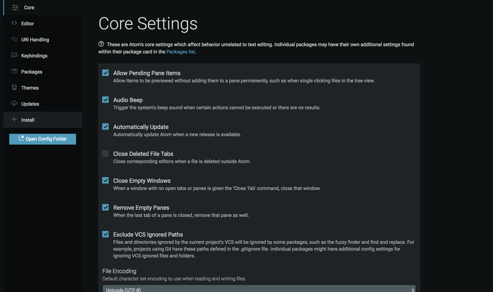
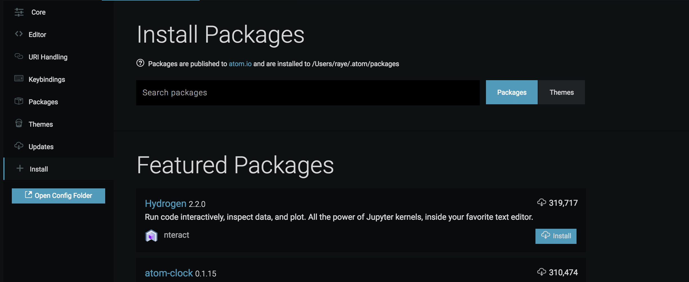

카카오 클론 코딩입니다.

안녕하세요. 카카오 클론 코딩에 들어가기 전에 먼저 몇가지 준비 할것이 있습니다.

1. Atom 에디터 다운받기 https://atom.io/
2. Atom 에디터를 열어주세요. MAC [ Cmd + , ] 그리고 WIN [ CTRL + , ] 을 눌러 atom 에디터의 Settings 들어갑니다. 그러면 Core Settings 라고 되어 있는 창이 나타납니다. 왼쪽에 보시면 + Install 이라는 메뉴를 눌러주세요. 
3. Install 메뉴에 진입하시면 아래의 화면이 나옵니다. Search 란에 live server 라고 검색해주세요.  
4. 검색을 하시면 많은 리스트가 나오는게 그 중 2번째 atom-live-server 를 Install 해주시면 됩니다.
